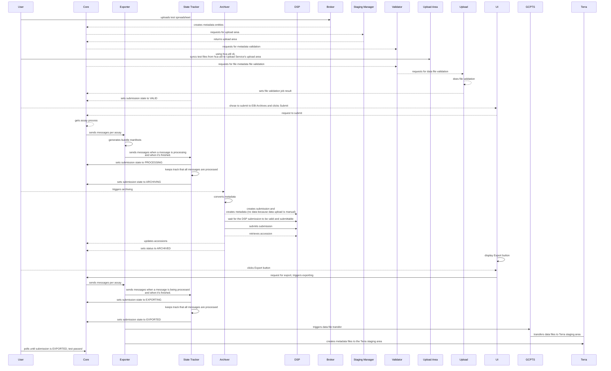

# Ingest State Tracking

Service for tracking the state of submissions through the ingestion process

# Submission state diagram


# Testing locally

* Modify `docker-compose.yaml` to have the latest images you need. Check latest image for each repositories in [ebi-ait organization in quay.io](https://quay.io/organization/ebi-ait)

* Running, killing, stopping `docker-compose` containers
```bash
docker-compose -p st up -d
docker-compose -p st stop
docker-compose -p st kill
```

* Checking logs
```bash
docker logs -f st_core_1 
```

# State tracking - sequence diagram

